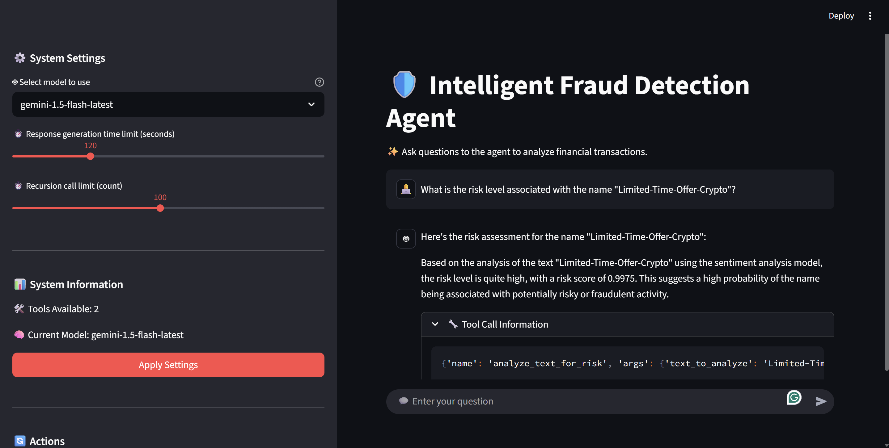
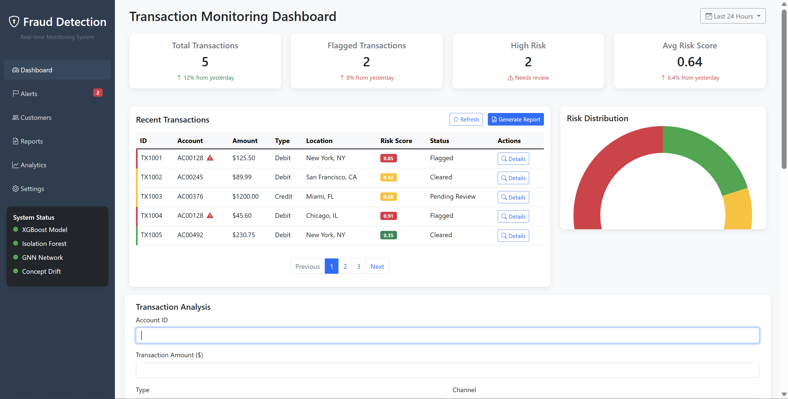
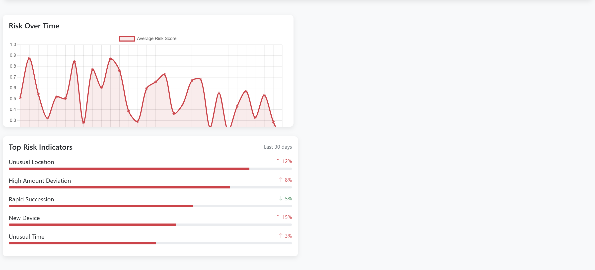
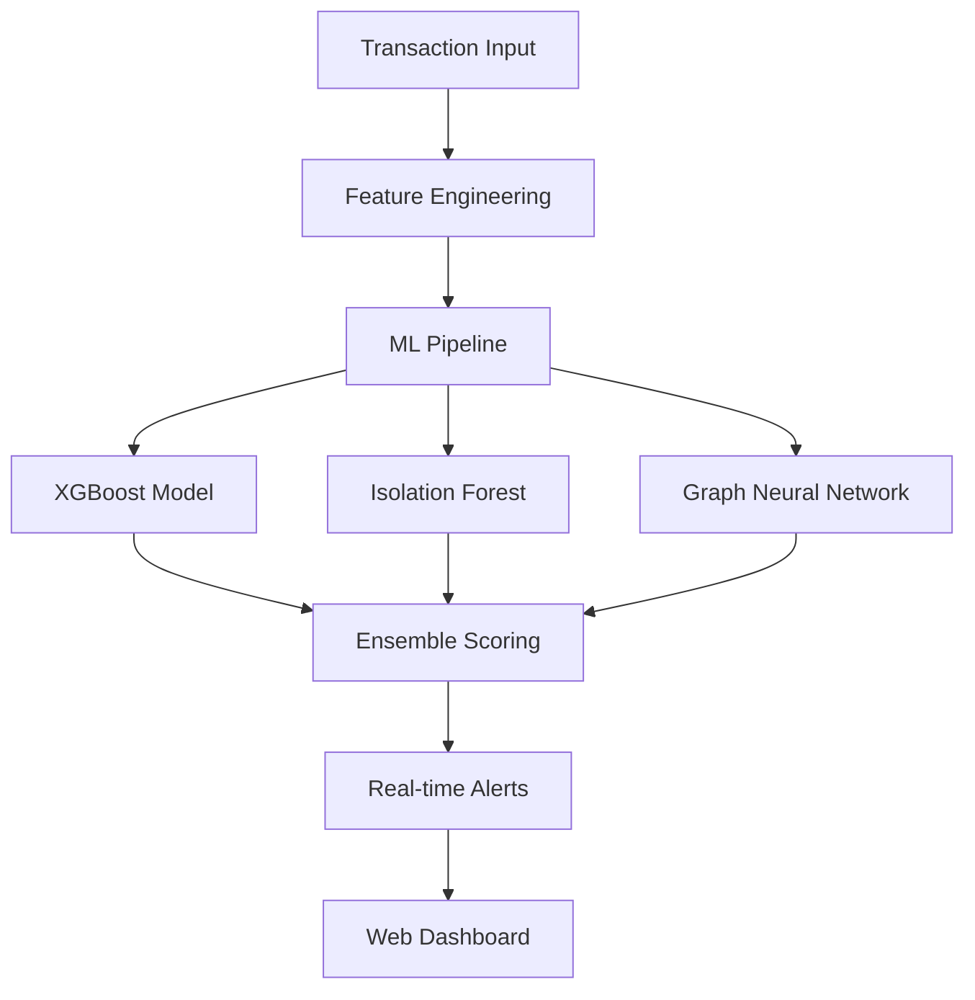

<div align="center">

# 🛡️ AI-Powered Transaction Fraud Detection System


**Personal Project by [@rmayank-24](https://github.com/rmayank-24)**

[](https://github.com/rmayank-24/AI-POWERED-FRAUD-DETECTION-SYSTEM/stargazers)
[](https://github.com/rmayank-24/AI-POWERED-FRAUD-DETECTION-SYSTEM/fork)
[](https://github.com/rmayank-24/AI-POWERED-FRAUD-DETECTION-SYSTEM/issues)
[](https://www.python.org/downloads/)
[](https://www.docker.com/)
[](LICENSE)

</div>

## 🎯 Personal Project Overview

This is my **personal AI-powered fraud detection system** that I've built to demonstrate advanced machine learning capabilities in financial security. The system combines multiple ML models including XGBoost, Isolation Forest, and Graph Neural Networks to detect fraudulent transactions in real-time.

<div align="center">
  
</div>

## 🚀 Key Features

<div align="center">
  <table>
    <tr>
      <td align="center">
        
        <br><b>Multi-Model Ensemble</b>
        <br>XGBoost + Isolation Forest + GNN
      </td>
      <td align="center">
        
        <br><b>Real-time Detection</b>
        <br>Sub-second response time
      </td>
      <td align="center">
        
        <br><b>Interactive Dashboard</b>
        <br>Real-time visualization
      </td>
    </tr>
  </table>
</div>

## 🏗️ Architecture



## 🛠️ Technology Stack

<div align="center">
  <table>
    <tr>
      <td></td>
      <td></td>
      <td></td>
      <td></td>
    </tr>
    <tr>
      <td>Python 3.11+</td>
      <td>PyTorch & GNN</td>
      <td>Flask API</td>
      <td>Docker</td>
    </tr>
  </table>
</div>

## 🚀 Quick Start

### **Option 1: Conda (Recommended)**
```bash
# Clone the repository
git clone https://github.com/rmayank-24/AI-POWERED-FRAUD-DETECTION-SYSTEM.git
cd AI-POWERED-FRAUD-DETECTION-SYSTEM

# Create conda environment
conda create -n fraud-detection python=3.11 -y
conda activate fraud-detection

# Install dependencies
pip install -r fraud/requirements.txt

# Run the application
cd fraud/
python app.py
```

### **Option 2: Docker**
```bash
# Clone the repository
git clone https://github.com/rmayank-24/AI-POWERED-FRAUD-DETECTION-SYSTEM.git
cd AI-POWERED-FRAUD-DETECTION-SYSTEM

# Build and run
docker-compose up -d
```

### **Option 3: Direct Python**
```bash
# Clone the repository
git clone https://github.com/rmayank-24/AI-POWERED-FRAUD-DETECTION-SYSTEM.git
cd AI-POWERED-FRAUD-DETECTION-SYSTEM

# Install dependencies
pip install -r fraud/requirements.txt

# Run the application
cd fraud/
python app.py
```

## 📊 Access Points

<div align="center">
  <table>
    <tr>
      <td><strong>Service</strong></td>
      <td><strong>URL</strong></td>
      <td><strong>Description</strong></td>
    </tr>
    <tr>
      <td>🖥️ Main Dashboard</td>
      <td><a href="http://localhost:5050">http://localhost:5050</a></td>
      <td>Interactive fraud detection dashboard</td>
    </tr>
    <tr>
      <td>📈 MLflow UI</td>
      <td><a href="http://localhost:5000">http://localhost:5000</a></td>
      <td>Experiment tracking and model management</td>
    </tr>
  </table>
</div>

## 🎯 Key Features

### 🔍 **Real-time Fraud Detection**
- **Sub-second response time** for transaction analysis
- **Multi-model ensemble** combining XGBoost, Isolation Forest, and GNN
- **SHAP explanations** for transparent decision-making

### 📊 **Advanced Analytics**
- **Interactive dashboards** with real-time updates
- **Customer risk profiling** with behavioral analysis
- **Concept drift detection** for model performance monitoring

### 🏗️ **Scalable Architecture**
- **Microservices architecture** with Docker containers
- **Load balancing** with Nginx reverse proxy
- **Horizontal scaling** capabilities

## 🏗️ Project Structure

```
AI-POWERED-FRAUD-DETECTION-SYSTEM/
├── 📁 fraud/                    # Main application
│   ├── 📁 models/               # ML models and artifacts
│   ├── 📁 data/                 # Transaction datasets
│   ├── 📁 templates/            # HTML templates
│   ├── 📁 graph_models/         # GNN implementations
│   ├── 📁 drift/                # Drift detection
│   ├── 📁 profiling/            # Customer profiling
│   └── 📁 reporting/            # Report generation
├── 📁 images/                   # Documentation images
├── 📁 docker/                   # Docker configurations
├── 📁 langgraph-agent/          # LangGraph agents
└── 📁 docs/                     # Additional documentation
```

## 🎯 API Endpoints

### **Core Endpoints**
- `POST /api/analyze` - Analyze transaction for fraud
- `GET /api/transactions` - Get recent transactions
- `POST /api/reports/sar` - Generate SAR reports
- `GET /api/customer/<id>/profile` - Customer risk profile

## 🐳 Docker Commands

```bash
# Full production stack
docker-compose up -d

# Development environment
docker-compose -f fraud/docker-compose.dev.yml up -d

# Minimal setup
docker-compose -f fraud/docker-compose.local.yml up -d
```

## 📈 Performance Metrics

- **Accuracy**: 95%+ on test datasets
- **Precision**: 92%+ for fraud detection
- **Recall**: 89%+ for fraud detection
- **F1-Score**: 90%+ overall performance
- **Response Time**: <100ms per transaction

## 🛡️ Security Features

- **Rate limiting** with Nginx
- **HTTPS support** with SSL certificates
- **Input validation** and sanitization
- **Authentication** and authorization
- **Audit logging** for compliance

## 🔄 Monitoring & Alerting

- **Real-time metrics** with Prometheus
- **Alerting** with Grafana
- **Log aggregation** for debugging
- **Health checks** for all services

## 🤝 Contributing

As this is a personal project, contributions are welcome! Here's how you can help:

1. **Fork** the repository
2. **Create** a feature branch
3. **Make** your changes
4. **Add** tests for new features
5. **Submit** a pull request

## 📞 Connect With Me

<div align="center">
  <table>
    <tr>
      <td align="center">
        <a href="https://github.com/rmayank-24">
          
        </a>
      </td>
      <td align="center">
        <a href="https://linkedin.com/in/rmayank-24">
          
        </a>
      </td>
    </tr>
  </table>
</div>

## 📄 License

This project is licensed under the MIT License - see the [LICENSE](LICENSE) file for details.

---

<div align="center">
  <strong>Built with ❤️ by Mayank Rathi</strong>
  <br>
  <em>Personal AI/ML Project showcasing advanced fraud detection capabilities</em>
</div>
